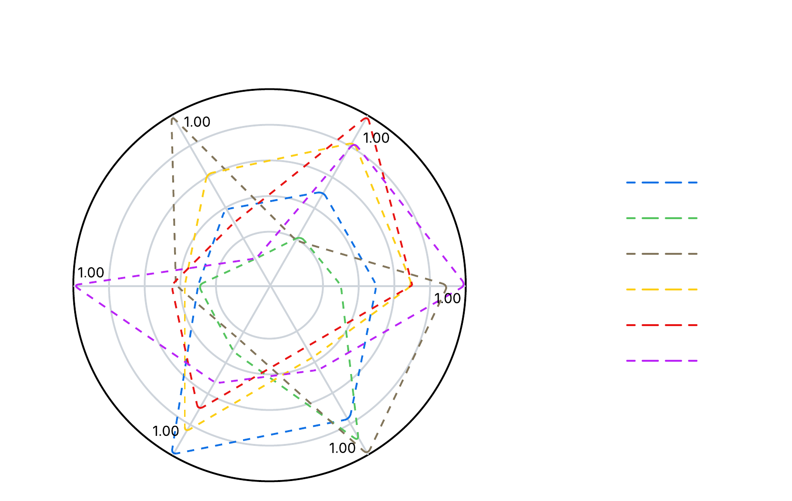

# Miner Behavior YOLO (MB-YOLO)

MB-YOLO is an optimized and energy efficient variant of the YOLOv11 architecture designed for real-time detection of miners’ behaviors in challenging underground environments. It integrates three key improvements:
* An enhanced Spatial Pyramid Pooling - Fast (SPPF) module augmented with Large Scale Kernel Attention (LSKA), which expands the effective receptive field and strengthens spatial representations under low illumination and occlusions.
* A bounding-box regression loss based on Minimum Point Distance Intersection over Union (MPDIoU) to improve optimization stability when predicted and ground-truth boxes share similar aspect ratios but differ in scale.
* A class-weighted Binary Cross Entropy (BCE) formulation to counteract severe class imbalance in the DsLMF+ dataset.

To ensure deployability on resource-constrained platforms commonly used in robotics, the trained models were exported to hardware-oriented formats, including ONNX for Central Processing Unit (CPU)-only devices and TensorRT with 16-bit floating-point (FP16) quantization for NVIDIA-based Graphics Processing Unit (GPU) platforms. These optimizations reduce memory footprint and computational overhead while
preserving performance, enabling efficient inference in embedded systems.

## Performance

Comprehensive experiments conducted on a workstation and two edge devices, Raspberry Pi 4 and Jetson Orin Nano Super, demonstrate the effectiveness of the proposed model. MBYOLO achieves 92.1% mAP@0.5 and 75.1% mAP@0.5:0.95, outperforming the YOLOv11n baseline by 1.2% and 0.8%, respectively, with minimal increases of 10.4% in parameters and 3.2% in Giga Floating-point operations (GFLOPs). On the Jetson Orin Nano Super, the model maintains 33 Frames per Second (FPS), meeting real-time requirements even after FP16 quantization. Regarding energy efficiency, MB-YOLO achieves GFPW = 1.90 on the Raspberry Pi 4 and GFPW = 1.15 on the Jetson Orin Nano Super, demonstrating a balanced trade-off between performance and power consumption despite its increased representational capacity.



<center>
    <table style="width:100%">
    <caption>MB-YOLO Performance Comparison with Standard YOLO Models in Jetson Orin Nano Super (TensorRT format - 16bit FP precision)</caption>
    <thead>
        <tr>
        <th>Model</th>
        <th>Params (M)</th>
        <th>GFLOPs</th>
        <th>mAP@0.5</th>
        <th>mAP@0.5:0.95</th>
        <th>FPS</th>
        <th>GFPW</th>
        </tr>
    </thead>
    <tbody>
        <tr>
        <td>YOLOv5n</td>
        <td>2.5</td>
        <td>7.1</td>
        <td>90.7</td>
        <td>73.6</td>
        <td>38</td>
        <td>1.28</td>
        </tr>
        <tr>
        <td>YOLOv8n</td>
        <td>2.81</td>
        <td>7.5</td>
        <td>90.7</td>
        <td>73.1</td>
        <td>30</td>
        <td>1.33</td>
        </tr>
        <tr>
        <td>YOLOv9t</td>
        <td>1.97</td>
        <td>7.6</td>
        <td>90.9</td>
        <td>74.8</td>
        <td>28</td>
        <td>1.36</td>
        </tr>
        <tr>
        <td>YOLOv10n</td>
        <td>2.26</td>
        <td>6.5</td>
        <td>90.8</td>
        <td>74.2</td>
        <td>36</td>
        <td>1.14</td>
        </tr>
        <tr>
        <td>YOLOv11n</td>
        <td>2.58</td>
        <td>6.3</td>
        <td>90.9</td>
        <td>74.3</td>
        <td>24</td>
        <td>1.12</td>
        </tr>
        <tr>
        <td>MB-YOLO</td>
        <td>2.85</td>
        <td>6.5</td>
        <td>92.1</td>
        <td>75.1</td>
        <td>32</td>
        <td>1.15</td>
        </tr>
    </tbody>
    </table>
</center>

## Dataset Download

Windows

  ```bash
  # Install library
  pip3 install gdown

  # Create a folder called datasets
  mkdir -p datasets/DsLMF_minerBehaviorDataset

  # Download and unzip dataset
  gdown https://drive.google.com/file/d/1uUtCLAlhftJHBlwMgX0mPQdrz5JZkAFF/view?usp=sharing -O .\datasets\DsLMF_minerBehaviorDataset  --fuzzy

  Expand-Archive -Path .\datasets\DsLMF_minerBehaviorDataset\DsLMF_minerBehaviorDataset.zip .\datasets\DsLMF_minerBehaviorDataset\

  # Download yaml file
  gdown https://drive.google.com/file/d/1rPnNVYKa1DmA9FLAj6JqgblUr5SZi0Va/view?usp=sharing -O .\datasets\  --fuzzy
  ```

Linux

  ```bash
  # Install library
  pip3 install gdown

  # Create a folder called datasets
  mkdir -p datasets/DsLMF_minerBehaviorDataset

  # Download and unzip dataset
  gdown https://drive.google.com/uc?id=\1uUtCLAlhftJHBlwMgX0mPQdrz5JZkAFF -O datasets/DsLMF_minerBehaviorDataset/

  unzip datasets/DsLMF_minerBehaviorDataset/DsLMF_minerBehaviorDataset.zip -d datasets/DsLMF_minerBehaviorDataset/

  # Download yaml file
  gdown https://drive.google.com/uc?id=\1rPnNVYKa1DmA9FLAj6JqgblUr5SZi0Va -O datasets/
  ```

## Installation

Windows VSCode (Virtual Env Recommended)

  ```bash
  # Clone the repository
  git clone https://github.com/deox1994/masterEnv

  # Create the virtual environment and activate
  python -m venv masterEnv
  cd masterEnv
  source bin/activate

  # Install pre-requisites
  pip3 install torch torchvision --index-url https://download.pytorch.org/whl/cu126
  pip3 install ultralytics=8.3.155
  pip3 install tensorrt
  ```

<br>

Jetson Orin Nano Super (Docker Recommeded)

  ```bash
  # Clone the repository
  git clone https://github.com/deox1994/masterEnv

  # Export platform
  export JETSON=ultralytics/ultralytics:latest-jetson-jetpack6

  # Create Docker image
  cd masterEnv
  sudo docker build --build-arg BASE_IMAGE=$JETSON -t jetsonimage -f Dockerfile .

  # Run Docker image
  sudo docker run -it --ipc=host --rm --privileged -v /sys:/sys -v/dev:/dev -v /path/to/datasets/folder/:/datasets --runtime=nvidia jetsonimage bash
  ```

<br>

Raspberry Pi (Docker Recommeded)

  ```bash
  # Clone the repository
  git clone https://github.com/deox1994/masterEnv

  # Export platform
  export RASPI=ultralytics/ultralytics:latest-arm64

  # Create Docker image
  sudo docker build --build-arg BASE_IMAGE=$RASPI -t raspiimage -f Dockerfile .

  # Run Docker image
  sudo docker run -it --ipc=host --rm --privileged -v /sys:/sys -v/dev:/dev -v /path/to/datasets/folder/:/datasets raspiimage bash
  ```

## Model Training


## Model Export

```bash
python <export.py> <modelName> </path/to/save/exported/model>  --format <format> --half
```

* Windows
```bash
python .\export.py v5n_Base .\models\exported\RTX3060  --format engine --half
```

* Jetson Orin Nano Super
```bash
python export.py v5n_Base models/exported/OrinNanoSup --format engine --half
```

* Raspberry Pi5
```bash
python export.py v5n_Base models/exported/Raspi --format onnx --half
```

## Model Evaluation

```bash
python <evaluate.py> <modelName> </path/to/save/exported/model>  --format <format> --half
```

Windows
```bash
python evalModel.py v5n_Base .\models\exported\RTX3060\ --format engine
```

Jetson Orin Nano Super
```bash
python evalModel.py v5n_Base models/exported/OrinNanoSup/ --format engine --data datasets/DsLMF_minerBehaviorDataset/images/val/
```

Raspberry Pi5
```bash
python evalModel.py v5n_Base models/exported/Raspi4/ --format onnx --data datasets/DsLMF_minerBehaviorDataset/images/val/
```


- Evitar reemplazar el archivo settings.json cuando se usa docker. Es mejor poner que el usuario ingrese el comando:
yolo settings datasets_dir=/path/to/datasets. Para ver cuales son los valores reales se puede usar yolo settings en el command line.
Tambien se puede sugerir al usuario que cambie la carpeta donde se almacenaran los resultados.

- Actualizar los dockerfiles considerando que ya no se debera usar la linea:
COPY ultralytics/.config/settings.json /root/.config/Ultralytics

- Seria bueno que se explique que el proceso de evaluacion consta de dos partes: La primera hace una evaluacion entre el ground truth y las resultados predichos para estimar el mAP. Mientras que la segunda se enfoca en hacer inferencia y verificar la velocidad que toma esta asi como el consumo energetico.

- En el caso de evaluation faltan colocar ejemplos donde se usen los argumentos --power y --serialPort.

- Unificar Docker donde se pasa como argumento la imagen base. Previamente se debe indicar que se debe colocar 
export ORINNANO = ultralytics/ultralytics:latest-jetson-jetpack6
export ORINNANO = ultralytics/ultralytics:latest-arm64

- Actualizar gitignore para que se ignore la carpeta datasets

- Hacer pruebas para que cada uno de los scripts (train, export y eval) funcionen correctamente en las tres plataformas.
