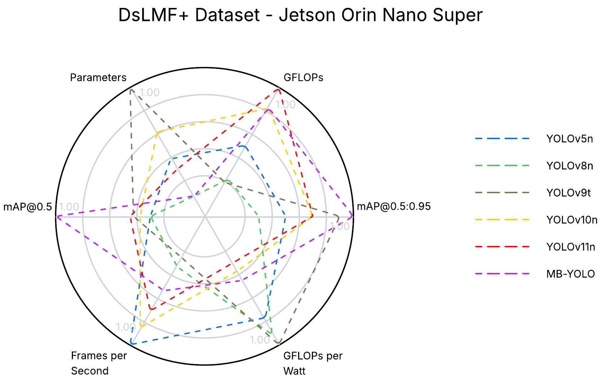

## Miner Behavior YOLO (MB-YOLO)

MB-YOLO is an optimized and energy efficient variant of the YOLOv11 architecture designed for real-time detection of miners’ behaviors in challenging underground environments. It integrates three key improvements:
* An enhanced Spatial Pyramid Pooling - Fast (SPPF) module augmented with Large Scale Kernel Attention (LSKA), which expands the effective receptive field and strengthens spatial representations under low illumination and occlusions.
* A bounding-box regression loss based on Minimum Point Distance Intersection over Union (MPDIoU) to improve optimization stability when predicted and ground-truth boxes share similar aspect ratios but differ in scale.
* A class-weighted Binary Cross Entropy (BCE) formulation to counteract severe class imbalance in the DsLMF+ dataset.

### Performance

| Model | Params (M) | GFLOPs | mAP@0.5 | mAP@0.5:0.95 | FPS | GFPW
|---|---|---|---|---|---|---|
| YOLOv5n | 2.50 | 7.1 | 90.7 | 73.6 | 38 | 1.28 |
| YOLOv8n | 2.81 | 7.5 | 90.7 | 73.1 | 30 | 1.33 |
| YOLOv9t | 1.97 | 7.6 | 90.9 | 74.8 | 28 | 1.36 |
| YOLOv10n | 2.26 | 6.5 | 90.8 | 74.2 | 36 | 1.14 |
| YOLOv11n | 2.58 | 6.3 | 90.9 | 74.3 | 34 | 1.12 |
| MB-YOLO | 2.85 | 6.5 | 92.1 | 75.1 | 32 | 1.15 |

## Installation

